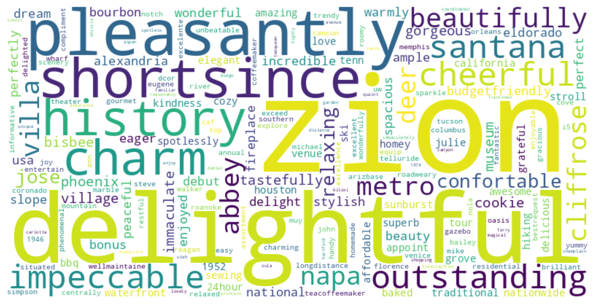
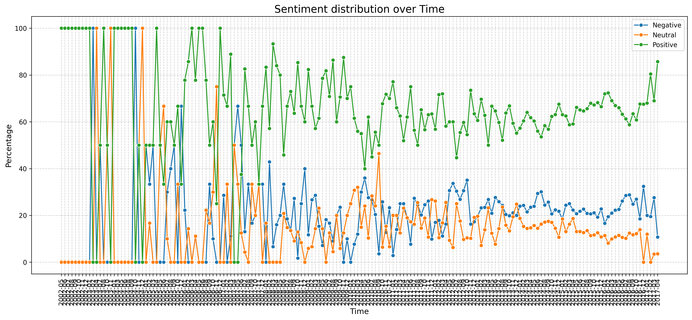
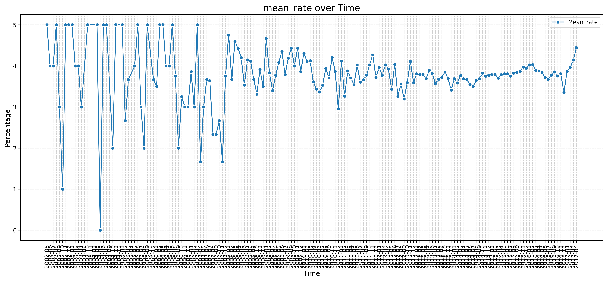

# Reviews Sentiment Analysis

[](https://colab.research.google.com/github/theophile-bb/Reviews-sentiment/blob/main/Reviews_Sentiment.ipynb)

This repository contains the code and accompanying notebook for performing **sentiment analysis on text reviews** using modern NLP tools and models. The aim is to classify reviews into sentiment categories and provide reusable functions for preprocessing, analysis, and inference.

---

## Project Structure

Reviews-sentiment/ <br>
├── data/ <br>
│ ├── raw_sample.csv # Small sample dataset <br>
├── src/ <br>
│ ├── init.py <br>
│ └── utils.py # Reusable functions for data & model <br>
├── plots/ # Saved visualizations <br>
├── Reviews_Sentiment.ipynb # Main analysis notebook <br>
├── requirements.txt <br>
├── .gitignore <br>
└── README.md <br>

---

## 📋 Prerequisites

This project requires:

- Python 3.7+
- A working Python environment (venv, conda, etc.)

---

## ⚙️ Installation

Clone the repository and install dependencies:

```
$ git clone https://github.com/theophile-bb/Reviews-sentiment.git
$ cd Reviews-sentiment
$ pip install -r requirements.txt
```


## Getting the data

The data used for this project are available on kaggme at this address : https://www.kaggle.com/datasets/datafiniti/hotel-reviews.

The repository contains a small sample dataset for quick testing.
For larger datasets:

Place your data in data/raw/

Use functions in src/utils.py to load and process it

## Notebook

The main notebook Reviews_Sentiment.ipynb walks through:

- Reading and cleaning text data

- Preprocessing and tokenization

- Model inference and evaluation

- Visualization of results

- Example of predictions


## Visualizations

Example of visualizations made :

*Wordcloud for positive reviews*


*Evolution of reviews sentiment of time*


*Mean rate over time*



